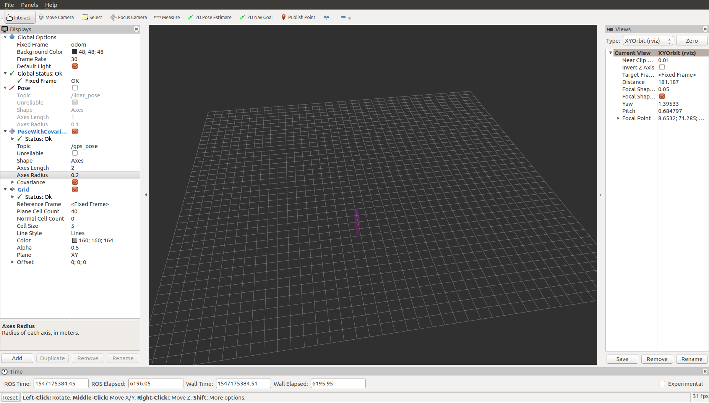

# geodetic_utils

## Description
Simple library for converting coordinates to/from several geodetic frames and managing incoming GPS information.

## Libraries
### geodetic_conv

* Stores a frame as a reference

* Converts between various co-ordinate systems: WGS84, ECEF, ENU, NED (see 'Notes' below)  

  ## Quick Start

###install & Build

The following steps build and install geodetic_utils, which is needed to support the 

[catkin_simple](https://github.com/catkin/catkin_simple) package.

```shell
cd mysrc
git clone git@github.com:catkin/catkin_simple.git 
git clone git@github.com:glmhit/geodetic_utils.git
catkin build
source ./devel/setup.zsh

```


```shell
roslaunch geodetic_utils set_gps_refer.launch
```

```shell
rosbag play my_data.bag
```

```shell
roslaunch geodetic_utils gps_to_pose.launch
```




## Nodes

### set_gps_reference_node

Creates a reference frame based on initial GPS measurements
#### Arguments
* number of initial GPS measurements to wait for and average over

#### Subscribed Topics:
* `gps` ([sensor_msgs/NavSatFix](http://docs.ros.org/api/sensor_msgs/html/msg/NavSatFix.html)) - GPS sensor information

### gps_to_pose_conversion_node
Publishes position information based on GPS measurements and initialised reference frame
#### Parameters
* `sim` - true if GPS readings received from /gazebo using Hectors plugin, false if received from actual device
* `frame_id` - string in header field of output messages ("world" is the default one if it's not specified)

#### Subscribed Topics:
* `gps` ([sensor_msgs/NavSatFix](http://docs.ros.org/api/sensor_msgs/html/msg/NavSatFix.html)) - GPS sensor information

#### Published Topics:
* `gps_pose` ([geometry_msgs/PoseWithCovarianceStamped](http://docs.ros.org/api/geometry_msgs/html/msg/PoseWithCovarianceStamped.html)) - local ENU co-ordinates in initialised reference frame


## Dependencies:
* ros
* geometry_msgs
* sensor_msgs

## Notes:
Co-ordinate systems supported:
* [WGS84](https://en.wikipedia.org/wiki/World_Geodetic_System) - Global Positioning System  - [latitude, longtitude, height]
* [ECEF](https://en.wikipedia.org/wiki/ECEF) - Earth-Centred, Earth-Fixed - [x,y,z] in Earth frame
* [ENU](https://en.wikipedia.org/wiki/Axes_conventions#Ground_reference_frames:_ENU_and_NED)   - East, North, Up            - [x,y,z] in local frame
* [NED](https://en.wikipedia.org/wiki/Axes_conventions#Ground_reference_frames:_ENU_and_NED)   - North, East, Down            - [x,y,z] in local frame

## Credits:
Enric Galceran, Marija Popović - ETHZ ASL - 15 October 2015
